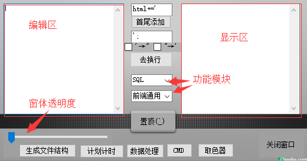
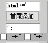

# cydaicenTool
> 本工具是个windows桌面可执行程序，主要处理一些日常的小功能，运用了.Net WinForm
如有问题或者建议 欢迎Issues or Pull requests.

## 如何使用

1. `git clone` 到本地
2. 打开 `bin/Debug/cydiacenTool.exe`即可享用。
3. 由于是可执行文件，为方便打开 可以右键添加快捷方式到桌面。

## 如何修改

1. 打开VS
2. 文件->打开->项目/解决方案
3. 找到项目中的`cydiacenTool.csproj`文件，并双击，即可修改和查看代码。

## 主要功能



> 以下功能统一输入在左边的大输入框(编辑区)内，结果会显示在右边的输入框(显示区)，并且会自动将结果存放在粘贴板中。

### 1. 字符串首尾添加 

如:
```html
<div>123</div>

<div>123</div>

<div>123</div>
```

运用此功能 可以快速修改为：

```javascript
html +='<div>123</div>'

html +='<div>123</div>'

html +='<div>123</div>'
```
当然 首尾字符可以自行修改。下面两个checkBox主要是用来替换编辑区中的引号转换。

### 2. 去换行

顾名思义 就是可以去除编辑区文本的所有换行符,支持上方的引号批量替换。

### 3. 显示截图

这个功能 可以借助QQ截图也可用本工具的截图功能。主要方便一些多窗口操作，
比如需要频繁的切换在两个窗口之间，可以使用此功能，将一个窗口的信息截图，并自动置顶。

### 4.  获取mac地址

### 5. linq转sql  （暂未实现）

### 6. MD5 

将编辑区的内容 通过`MD5`加密成32位大写模式。

### 7.计划计时

该功能主要是方便自己管理日常的时间消耗：

    1. 在下方计划内容处，输入此次计划内容
    2. 点击开始
    3. 如果中途需要暂停 可以点击暂停（暂不支持多线程处理计划，欢迎补充！）
    4. 也可取消计划(友情提示：不要半路放弃哦！)

### 8. CMD区
    1. 定时关机
    2. IPconfig
    3. 公司IP(勿点)
    4. 自动(切换到自动ip)
    5. 家里Ip(勿点)

### 9. 取色器

点击取色器之后，右键你要取色的地方，会将该地方的颜色 以`#AABBCC`的形式 复制到你的粘贴板。

### 10. 生成文件结构

主要适用于公司本人所在的产品线 文件结构，可根据个人需要 自行修改源码。

使用方法：

    1. 输入模块名称 推荐以小驼峰形式输入 如：testTool
    2. 输入子模块名称 (首字母大写，多个用`|`隔开) 如：Detail|List|Edit
    3. 点击生成 会在D盘创建一个Tool并将模块加入其中。
生成结构:
```
D:Tool/testTool
          |--testTool-app
                |--app.js
                |--controller.js
                |--services.js
          |--testTool-detail-app
                |--app.js
                |--controller.js
                |--services.js
          |--testTool-edit-app
                |--app.js
                |--controller.js
                |--services.js
          |--testTool-list-app
                |--app.js
                |--controller.js
                |--services.js
```
js代码中已将部分依赖写好，当然肯定会有所遗漏 欢迎补充！


